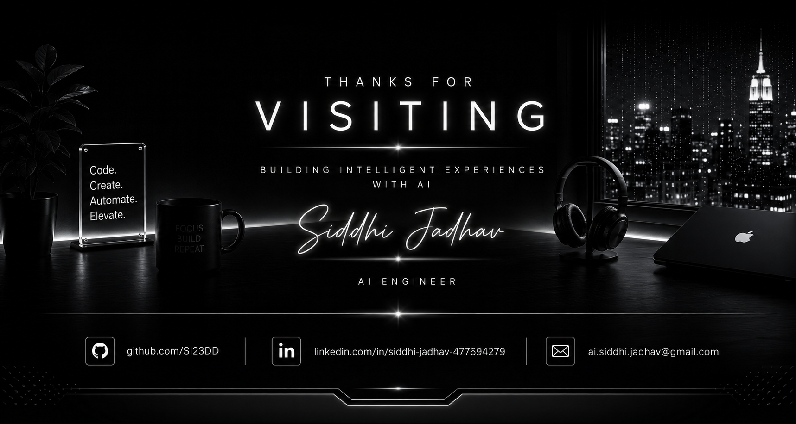

  

  

<h1>Siddhi Jadhav</h1>

<h3>AI Engineer • Full Stack Developer • Generative AI</h3>

Building intelligent products with AI, automation and modern web technologies.

 

  

---

## Snapshot

| Role | Projects | Stack | Focus |
|---|---:|:---:|:---:|
| 🧠 AI Engineer | 8+ AI & Full Stack products | Python • React • Flutter | LLMs • AI Agents • RAG |

---

## Featured Work

- 🎨 SixArt.ai — AI Creative Platform: Create images, videos, music and audio with generative models.
  - Tech: React • FastAPI • Python • Generative AI

- 🤖 AI Agent Builder — Custom AI agents with workflows and knowledge bases.
  - Tech: React • Node.js • LLMs • RAG

- 👮 Maharashtra Police Dashboard — Enterprise dashboard for managing workflows and users.
  - Tech: React • Node.js • MongoDB

- 👕 AI Virtual Try-On — Computer-vision powered virtual try-on for fashion.
  - Tech: Python • OpenCV • Flask

---

## Tech Stack

---

## About

I build production-ready AI applications that combine large language models, retrieval-augmented generation, and automation with scalable web frontends and APIs. My focus is on delivering systems that are useful, reliable, and maintainable.

---

## How I Work / Highlights

- End-to-end product delivery: prototype → MVP → production
- Experience with RAG pipelines, LLM prompt engineering, and agent design
- Production deployments using Docker, CI/CD, and monitoring

---

## Contact

- GitHub: [@SI23DD](https://github.com/SI23DD)

---

