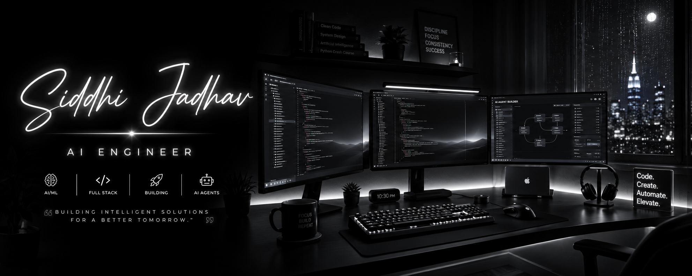

  

  

# Siddhi Jadhav

### AI Engineer • Full Stack Developer • Generative AI

Building intelligent products powered by AI, automation, and modern web technologies.

---

# 👋 About Me

I'm passionate about creating AI-powered applications that solve real-world problems.

Currently working as an **AI Engineer** at **X38 AI Labs**, where I build AI agents, enterprise dashboards, Flutter applications, and full stack products.

### What I enjoy building

- 🤖 Generative AI Applications
- 🧠 AI Agent Platforms
- 🌐 Full Stack Web Apps
- 📱 Flutter Applications
- ⚡ Automation Systems
- 🎨 Beautiful User Interfaces

---

# 💼 Experience

### AI Engineer

**X38 AI Labs Pvt. Ltd.**

Building enterprise AI platforms, AI agents, dashboards, automation systems, and production-ready applications.

---

# 🚀 Featured Projects

<table>
<tr>

<td width="50%">

## 🎨 SixArt.ai

Create AI Images, Videos, Music and Audio from one platform.

**Tech**

React • FastAPI • Python • AI APIs

</td>

<td width="50%">

## 🤖 AI Agent Builder

Build AI Agents with knowledge bases and workflows.

**Tech**

React • Node.js • AI • RAG

</td>

</tr>

<tr>

<td>

## 👮 Police Dashboard

Enterprise dashboard for department management.

**Tech**

React • Node • MongoDB

</td>

<td>

## 👕 Virtual Try-On

AI clothing try-on using computer vision.

**Tech**

Python • OpenCV • Flask

</td>

</tr>

</table>

# ⚡ Tech Stack

### Languages

### Frontend

### Backend

### Database

### AI / ML

### Tools

---

# 📊 GitHub Stats

---

# 🐍 Contribution Snake

---

# 🌐 Connect With Me

&nbsp;&nbsp;&nbsp;

&nbsp;&nbsp;&nbsp;

---

## 💡 Current Focus

🧠 Building AI-powered products

⚡ Exploring LLMs, AI Agents & RAG

🚀 Shipping production-ready applications

🎯 Continuously learning and improving

---

# Thanks for Visiting 🤍

### Building Intelligent Experiences with AI

